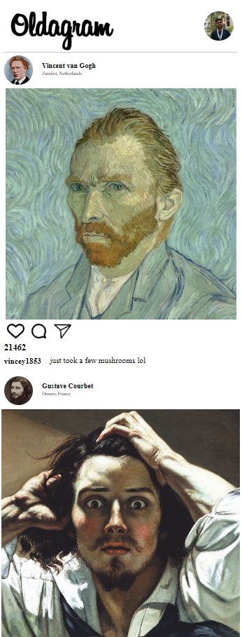

# Oldagram: A Nostalgic Instagram Clone

  

## Welcome to Oldagram! 📸

Oldagram is a whimsical Instagram clone that pays homage to the days of dial-up internet and pixelated graphics. It's a frontend project that combines the charm of the past with the functionality of the present, bringing a smile to both web development enthusiasts and nostalgia aficionados.

## Features

- **Semantic HTML and CSS**: Oldagram is built using semantic HTML and carefully crafted CSS, ensuring a visually pleasing and well-structured interface.

- **Dynamic Post Rendering**: JavaScript is the driving force behind Oldagram's dynamic post rendering. Experience the magic as posts seamlessly pop up on your screen.

- **Hover-tastic Effects**: Watch icons come to life with delightful hover effects. It's a throwback to the past with a modern twist!

- **Spread the Love with Double Tap**: Just like your favorite social media app, Oldagram lets you increase likes by double-clicking. It's the virtual version of a high-five! and design inspiration from scrimba

## Getting Started

1. Clone this repository to your local machine using `git clone https://github.com/yourusername/oldagram.git`
2. Navigate to the project directory: `cd oldagram`
3. Open the `index.html` file in your preferred browser to explore the Oldagram universe.

## Feedback and Contributions

Have ideas, feedback, or want to contribute? We'd love to hear from you! Feel free to open an issue or submit a pull request. Let's make Oldagram even more awesome together.

## Spread the Word

If Oldagram brought a smile to your face (or a nostalgic tear to your eye), consider sharing it with your friends and fellow developers. Let's spread the nostalgia, one like at a time!

---

Developed with ❤️ by [Divv Saxena](saxenadivv@gmail.com)
